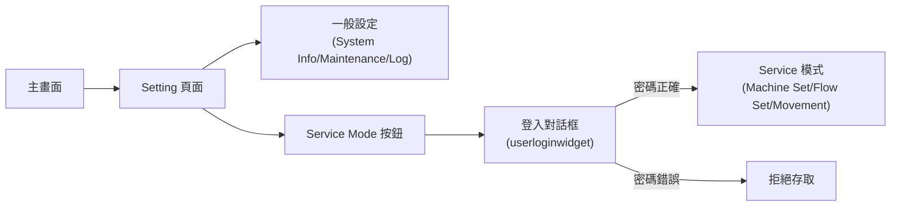
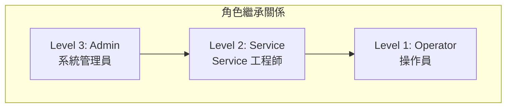
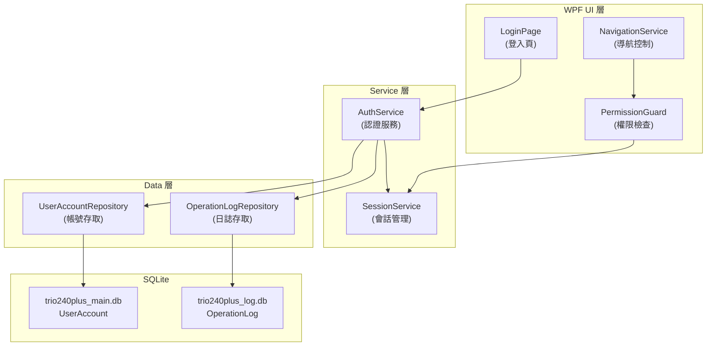
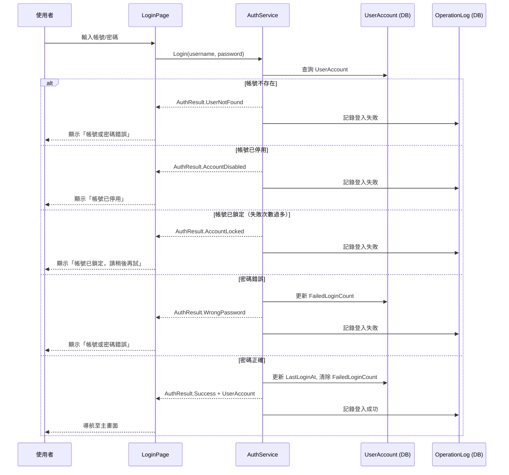
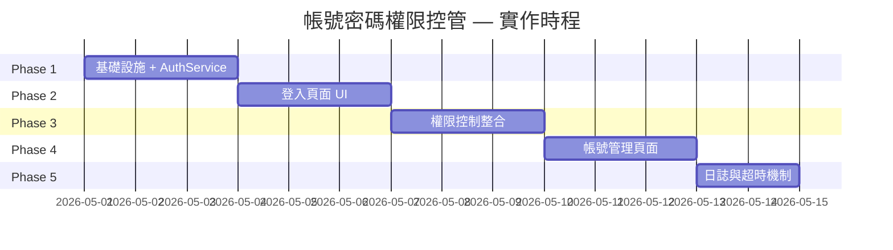

# TRIO2026 帳號密碼與權限控管 — 施作評估與分析

> **文件編號**: TRIO2026-AUTH-001  
> **撰寫**: Office of William  
> **日期**: 2026-04-29  
> **版本**: 1.0  

---

## 一、舊系統認證機制分析

### 1.1 現況

舊系統 TRIO240 使用 **最低限度的帳號密碼管理**，僅在 Setting 頁面進入 Service Mode 時觸發登入流程。



### 1.2 舊系統的安全問題

| 問題 | 嚴重度 | 說明 |
|------|:------:|------|
| **明碼密碼** | 🔴 嚴重 | `userinfo.db` 直接儲存明文密碼，任何人可讀取 |
| **硬編碼預設密碼** | 🔴 嚴重 | 預設密碼 `11112222` 寫死在原始碼 `userinfomanage.cpp:27` |
| **User 帳號自動登入** | 🟡 中等 | `slot_usernamechange()` 偵測到 `User` 時自動填入密碼，無需手動輸入 |
| **無登入日誌** | 🟡 中等 | 登入成功/失敗均無紀錄 |
| **無鎖定機制** | 🟡 中等 | 密碼錯誤無次數限制 |
| **僅 2 角色** | 🟢 低 | `operator` / `engineer`，權限粒度粗略 |
| **無密碼複雜度要求** | 🟢 低 | 任何字串皆可作為密碼 |
| **密碼記憶到 QSettings** | 🟡 中等 | 勾選「記住密碼」後密碼明文存入 Windows 註冊表 |

### 1.3 舊系統角色與 UI 權限對應

| 角色 | control 欄位 | 可存取的功能頁 |
|------|------------|-------------|
| User / Operator | `operator` | 一般操作（執行流程、查看結果）、Setting 一般頁面 |
| Engineer | `engineer` | 上述全部 + Service Mode（Machine Set / Flow Set / Movement） |

> **關鍵發現**: 舊系統的認證機制 **只保護 Service Mode 入口**，其他所有操作均無權限限制。

---

## 二、重構後的權限需求分析

### 2.1 建議的三級角色體系



| 角色 | RoleLevel | 對應舊系統 | 使用場景 |
|------|:---------:|----------|---------|
| **Operator** | 1 | User / Operator | 日常操作人員：執行流程、查看結果 |
| **Service** | 2 | Engineer | 現場服務工程師：系統校正、電機調試、流程編輯 |
| **Admin** | 3 | (新增) | 管理員：帳號管理、系統配置、資料匯出 |

### 2.2 功能權限矩陣

| 功能模組 | Operator (1) | Service (2) | Admin (3) |
|---------|:---:|:---:|:---:|
| **登入系統** | ✓ | ✓ | ✓ |
| **執行流程** | ✓ | ✓ | ✓ |
| **查看檢測結果** | ✓ | ✓ | ✓ |
| **匯出報表** | ✓ | ✓ | ✓ |
| **查看系統日誌** | ✓ | ✓ | ✓ |
| **修改樣本設定** | ✓ | ✓ | ✓ |
| **攝像頭校正** | | ✓ | ✓ |
| **電機參數調整** | | ✓ | ✓ |
| **流程編輯** | | ✓ | ✓ |
| **Movement 手動控制** | | ✓ | ✓ |
| **維護模式操作** | | ✓ | ✓ |
| **帳號管理（CRUD）** | | | ✓ |
| **密碼重設** | 自己 | 自己 | 全部 |
| **系統配置修改** | | | ✓ |
| **操作日誌匯出** | | | ✓ |
| **資料庫備份/還原** | | | ✓ |

---

## 三、技術架構設計

### 3.1 整體架構



### 3.2 核心元件設計

#### (A) AuthService — 認證服務

```
職責:
├── Login(username, password) → AuthResult
├── Logout()
├── ChangePassword(oldPwd, newPwd)
├── ResetPassword(targetUser)         ← Admin 專用
├── CreateUser(userInfo)              ← Admin 專用
├── DeactivateUser(username)          ← Admin 專用
└── GetAllUsers()                     ← Admin 專用
```

#### (B) SessionService — 會話管理

```
職責:
├── CurrentUser: UserAccount           ← 當前登入的使用者
├── IsAuthenticated: bool
├── HasPermission(requiredLevel): bool ← 權限檢查
├── SessionTimeout: TimeSpan          ← 閒置自動登出
└── event SessionChanged              ← 通知 UI 更新
```

#### (C) PermissionGuard — UI 權限控制

```
職責:
├── CanAccess(pageName): bool          ← 頁面存取控制
├── CanExecute(actionName): bool       ← 動作權限控制
└── FilterMenuItems(roleLevel): List   ← 選單過濾
```

### 3.3 密碼安全規範

| 項目 | 舊系統 | 新系統 |
|------|--------|--------|
| 儲存方式 | 明碼 | BCrypt 雜湊 ($2a$12$...) |
| 密碼長度 | 無限制 | 最少 6 字元 |
| 密碼複雜度 | 無 | 建議含英數字（可配置是否強制） |
| 失敗鎖定 | 無 | 連續 5 次失敗鎖定 15 分鐘 |
| 記住密碼 | 明文存 Registry | 加密 Token 或移除此功能 |
| 傳輸安全 | N/A（本機） | N/A（本機 SQLite） |

**NuGet 套件需求**: `BCrypt.Net-Next`（MIT 授權，免費）

### 3.4 登入流程



### 3.5 會話超時與自動登出

```
啟動系統 → 登入頁 → 驗證成功 → 主畫面
                                    ↓
                           閒置計時器啟動
                                    ↓
                      閒置超過 30 分鐘（可配置）
                                    ↓
                           自動登出 → 登入頁
```

> **注意**: 若系統正在執行流程，即使超時也不應自動登出，需等待流程完成。

---

## 四、UserAccount 資料表擴展

### 4.1 建議新增欄位

| 欄位名稱 | 型別 | 說明 | 是否必要 |
|---------|------|------|:--------:|
| FailedLoginCount | INTEGER | 連續登入失敗次數 | ✓ |
| LockedUntil | TEXT | 鎖定到期時間（ISO8601） | ✓ |
| PasswordChangedAt | TEXT | 密碼最後變更時間 | 選用 |
| DisplayName | TEXT | 顯示名稱 | 選用 |
| Email | TEXT | 電子郵件（沿用舊系統） | 選用 |

### 4.2 修改後的完整 Entity

```csharp
public class UserAccount
{
    public int Id { get; set; }
    public string Username { get; set; }
    public string PasswordHash { get; set; }       // BCrypt 雜湊
    public int RoleLevel { get; set; }              // 1=Operator, 2=Service, 3=Admin
    public int IsActive { get; set; }               // 0=停用, 1=啟用
    public string CreatedAt { get; set; }
    public string? LastLoginAt { get; set; }

    // === 新增欄位 ===
    public int FailedLoginCount { get; set; }       // 連續失敗次數（預設 0）
    public string? LockedUntil { get; set; }        // 鎖定到期時間
    public string? PasswordChangedAt { get; set; }  // 密碼變更時間
    public string? DisplayName { get; set; }        // 顯示名稱
}
```

---

## 五、實作工作量估算

### 5.1 分層工作清單

| 階段 | 工作項目 | 預估時間 | 依賴 |
|------|---------|:--------:|------|
| **Phase 1: 基礎設施** | | **2-3 天** | |
| | 安裝 BCrypt.Net-Next | 0.5h | NuGet |
| | 擴展 UserAccount Entity + 重建表結構 | 1h | |
| | 建立 IAuthService 介面 + AuthService 實作 | 4h | BCrypt |
| | 建立 SessionService（當前使用者 + 超時） | 3h | |
| | 建立 AuthResult 列舉 + DTO | 1h | |
| | 更新 Seed Data（使用 BCrypt 雜湊密碼） | 1h | BCrypt |
| **Phase 2: UI 登入** | | **2-3 天** | Phase 1 |
| | 建立 LoginPage（WPF UserControl） | 4h | |
| | 建立 LoginViewModel（MVVM 繫結） | 3h | AuthService |
| | 觸控鍵盤元件（舊系統為觸控螢幕操作） | 4h | |
| | 登入失敗/鎖定的 UI 提示 | 2h | |
| **Phase 3: 權限控制** | | **2-3 天** | Phase 2 |
| | 建立 PermissionGuard + 頁面權限映射 | 3h | SessionService |
| | Navigation 導航整合（選單根據角色顯示/隱藏） | 4h | PermissionGuard |
| | Service Mode 入口保護（沿用舊系統行為） | 2h | |
| | 權限不足的 UI 提示 | 1h | |
| **Phase 4: 帳號管理** | | **2-3 天** | Phase 3 |
| | Admin 帳號管理頁面（新增/修改/停用） | 6h | |
| | 密碼修改頁面（自己改密碼） | 3h | |
| | 密碼重設功能（Admin 對其他帳號） | 2h | |
| **Phase 5: 日誌與安全** | | **1-2 天** | Phase 4 |
| | 登入/登出事件寫入 OperationLog | 2h | LogDbContext |
| | 權限操作日誌（帳號管理 CRUD） | 2h | |
| | 會話超時自動登出（排除流程執行中） | 3h | |

### 5.2 總體估算

| 項目 | 估算 |
|------|------|
| **總工時** | 9-14 天（1 人） |
| **新增 NuGet 套件** | BCrypt.Net-Next（免費） |
| **新增/修改 C# 檔案** | ~15 個 |
| **影響的資料表** | UserAccount（擴展）、OperationLog（寫入） |
| **風險等級** | 低（本機 SQLite + WPF，無網路安全顧慮） |

---

## 六、建議實作優先順序



---

## 七、開放問題（待確認）

1. **觸控鍵盤**: 舊系統為觸控螢幕操作，登入頁是否需要內建虛擬鍵盤？
2. **自動登入**: 舊系統的 `User` 帳號自動登入功能是否保留？建議取消以提高安全性。
3. **密碼過期**: 是否需要強制定期更換密碼？（如 90 天）
4. **會話超時**: 閒置自動登出的時間設定為多少？建議 30 分鐘。
5. **流程執行中登出**: 流程執行中如果超時，是否允許鎖定畫面但不中斷流程？
6. **帳號數量上限**: 是否有帳號數量限制的需求？
7. **密碼記住功能**: 是否保留「記住密碼」？若保留，建議改用加密 Token 而非明文。

---

*文件結束*
