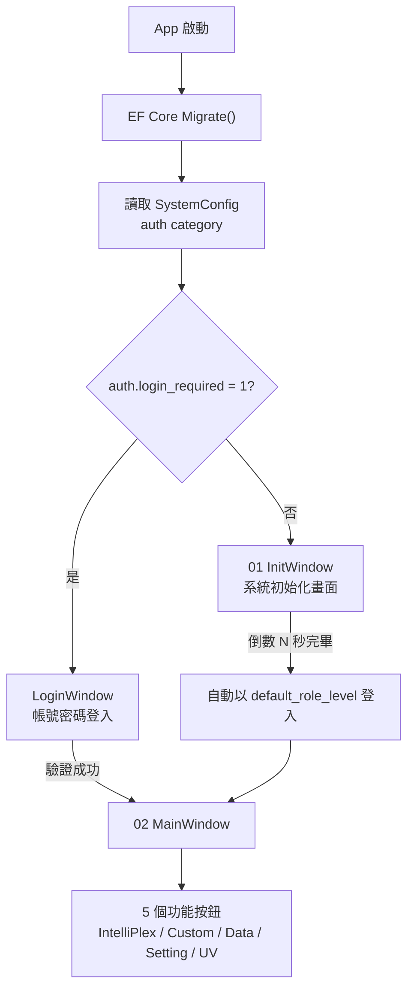

# Init 畫面(01) + Main 畫面(02) + 帳號驗證開關

## 舊系統分析結果

根據 `Trio-PC_3_7` 原始碼：

- **01 Init 畫面** = `CSysInitWidget`：系統初始化動畫（`DynamicPicTextWidget`），居中顯示載入狀態
- **02 Main 畫面** = `CMenuWidget`：4 個功能按鈕（2×2 網格），外加 UV
- **框架** = `GroundWidget` + `SysTopGroup`（頂部狀態列）+ `SysBottomGroup`（底部導航列）

02 畫面 5 個導航按鈕（對應舊系統 QSS ObjectName）：

| 按鈕 | 舊系統 ObjectName | 說明 |
|------|------------------|------|
| IntelliPlex Program | `enterintelliprepprogrambutton` | 內建流程執行 |
| Custom Program | `entercustprogrambutton` | 自訂流程執行 |
| Data | `enterhistorybutton` | 歷史數據查看 |
| Setting | `entersetbutton` | 系統設定 |
| UV | `openuvwidget` | UV 消毒 |

## 流程設計

## SystemConfig 新增參數（ConfigDB）

| Category | Key | DataType | 預設值 | 說明 |
|----------|-----|----------|--------|------|
| `auth` | `login_required` | bool | `0` | 是否啟動帳號密碼檢查 |
| `auth` | `init_wait_seconds` | int | `10` | Init 畫面等待秒數 |
| `auth` | `default_role_level` | int | `1` | 免登入時預設角色等級 |

## Proposed Changes

---

### SystemConfig 種子資料 + AppConfigService

#### [MODIFY] [AppConfigService.cs](file:///D:/TRIO2026/src/TRIO2026.App/Services/AppConfigService.cs)
- 新增 `auth` 便利屬性：`LoginRequired`, `InitWaitSeconds`, `DefaultRoleLevel`

#### [MODIFY] [App.xaml.cs](file:///D:/TRIO2026/src/TRIO2026.App/App.xaml.cs)
- Migrate 後載入 `auth` category
- 根據 `LoginRequired` 決定啟動 LoginWindow 或 InitWindow
- 兩者登入後都進入 MainWindow

---

### 01 InitWindow

#### [NEW] InitWindow.xaml + .xaml.cs
- 全螢幕深色背景，與 LoginWindow 同風格
- Viewbox 包覆 600×960 設計基準
- 居中 TRIO2026 品牌 Logo + 「System Initializing...」文字
- 圓形進度動畫 + 倒數秒數
- 倒數結束自動以 `default_role_level` 建立 Session → 開啟 MainWindow

---

### 02 MainWindow

#### [NEW] MainWindow.xaml + .xaml.cs
- Viewbox 包覆 600×960 設計基準
- **頂部**：Logo + 系統狀態 + 使用者/角色資訊
- **中央**：5 個功能按鈕卡片（2+2+1 或 2+3 排列）
  - IntelliPlex Program
  - Custom Program
  - Data
  - Setting
  - UV
- **底部**：版本資訊
- 每個按鈕暫時用 Overlay Dialog 顯示「功能開發中」

---

### EF Core Migration

#### [NEW] Migration: `AddAuthConfigSeed`
- 在 ConfigDB 的 SystemConfig 插入 3 筆 auth 設定

## Verification Plan

### Automated Tests
- `dotnet build` 整個 Solution
- 啟動模擬器測試兩種模式

### Manual Verification
1. `login_required = 1`：LoginWindow → 登入 → MainWindow（5 個按鈕）
2. `login_required = 0`：InitWindow → 倒數 10 秒 → MainWindow
