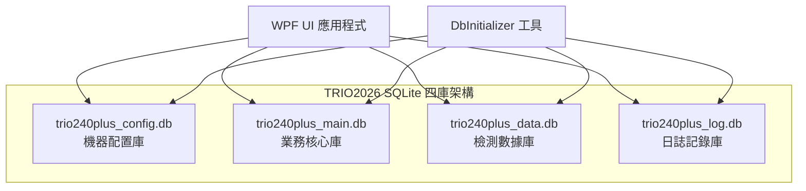

# TRIO2026 資料庫架構總覽

> **文件編號**: TRIO2026-DB-001  
> **撰寫**: Office of William  
> **日期**: 2026-04-28  
> **版本**: 1.0  
> **適用對象**: 開發人員、系統維護工程師  

---

## 一、架構概述

TRIO2026 採用 **SQLite 四庫分離架構**，以職責劃分資料庫，確保各模組間的獨立性與維護性。



---

## 二、四庫職責與內容

### 2.1 trio240plus_config.db — 機器配置庫

| 項目 | 說明 |
|------|------|
| **職責** | 儲存機器硬體參數、電機配置、指令定義等靜態配置 |
| **資料特性** | 低頻寫入、高頻讀取、系統啟動時載入 |
| **資料表** | SystemConfig (2,497 筆)、CommandDefinition (29 筆) |
| **資料來源** | 舊系統 12 個 .ini 檔案遷移 |

### 2.2 trio240plus_main.db — 業務核心庫

| 項目 | 說明 |
|------|------|
| **職責** | 管理使用者帳號、流程定義、產品映射等核心業務資料 |
| **資料特性** | 中頻讀寫、涉及外鍵關聯 |
| **資料表** | UserAccount (3 筆)、FlowDefinition (10 筆)、FlowStep (2,091 筆)、FlowMapping (18 筆)、PnidMapping (24 筆) |
| **資料來源** | flowinfo.ini + .flow 檔案遷移 |

### 2.3 trio240plus_data.db — 檢測數據庫

| 項目 | 說明 |
|------|------|
| **職責** | 儲存每次檢測運行的結果、樣本數據、報表快照 |
| **資料特性** | 高頻寫入（運行時）、歷史資料持續增長 |
| **資料表** | TestRecord、SampleResult、ReportSnapshot |
| **資料來源** | 運行時產生（目前 0 筆） |

### 2.4 trio240plus_log.db — 日誌記錄庫

| 項目 | 說明 |
|------|------|
| **職責** | 記錄使用者操作日誌和 Modbus 通訊紀錄 |
| **資料特性** | 高頻寫入、可定期歸檔清理 |
| **資料表** | OperationLog、CommunicationLog |
| **資料來源** | 運行時產生（目前 0 筆） |

---

## 三、技術規格

| 項目 | 規格 |
|------|------|
| 資料庫引擎 | SQLite（內建於 EF Core） |
| ORM 框架 | Entity Framework Core 10.0.7 |
| .NET 版本 | .NET 10.0 LTS |
| Journal Mode | WAL（允許讀寫並發） |
| Synchronous | NORMAL（平衡效能與安全） |
| Foreign Keys | ON（啟用外鍵約束） |
| Cache Size | 2 MB |
| Busy Timeout | 5,000 ms |

---

## 四、檔案位置

```
D:\TRIO2026\Database\
├── trio240plus_config.db     ← 機器配置
├── trio240plus_main.db       ← 業務核心
├── trio240plus_data.db       ← 檢測數據
└── trio240plus_log.db        ← 日誌記錄
```

---

## 五、相關文件索引

| 文件 | 路徑 | 說明 |
|------|------|------|
| 資料字典 | `DatabaseDocs/Data_Dictionary.md` | 全部 12 張表的欄位定義 |
| ER 圖 | `DatabaseDocs/ER_Diagram.md` | 實體關聯圖 |
| Seed Data 規格 | `DatabaseDocs/Seed_Data_Specification.md` | 初始資料來源與植入規則 |
| 元件清單 | `Dependencies_and_Components.md` | NuGet 套件版本紀錄 |

---

*文件結束*
