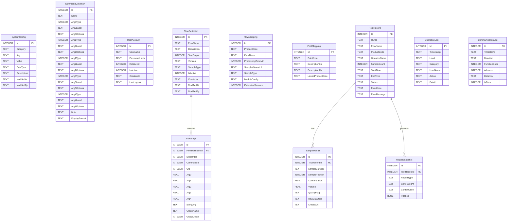
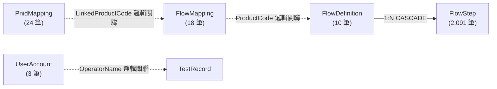
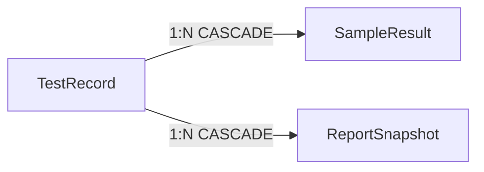
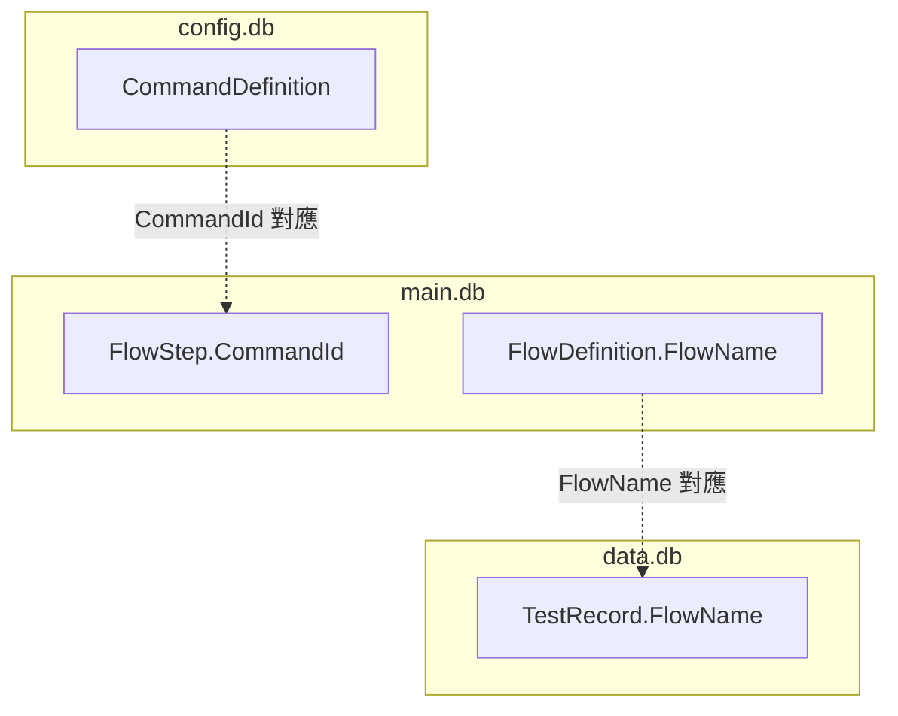
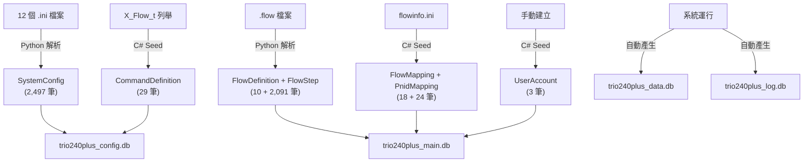

# TRIO2026 實體關聯圖 (ER Diagram)

> **文件編號**: TRIO2026-DB-003  
> **撰寫**: Office of William  
> **日期**: 2026-04-28  
> **版本**: 1.0  

---

## 一、四庫全域 ER 圖

---

## 二、關聯說明

### 2.1 trio240plus_main.db 內部關聯

- **FlowDefinition → FlowStep**: 物理外鍵，CASCADE 刪除。刪除流程時自動刪除所有步驟。
- **FlowMapping ↔ FlowDefinition**: 邏輯關聯（透過 FlowName 欄位），無物理外鍵。
- **PnidMapping ↔ FlowMapping**: 邏輯關聯（透過 LinkedProductCode），無物理外鍵。

### 2.2 trio240plus_data.db 內部關聯

- **TestRecord → SampleResult**: 物理外鍵，CASCADE 刪除。
- **TestRecord → ReportSnapshot**: 物理外鍵，CASCADE 刪除。

### 2.3 跨庫邏輯關聯（無物理外鍵）

> **設計決策**: 跨庫不建立物理外鍵（SQLite 不支援跨資料庫外鍵），改由應用層確保一致性。

---

## 三、資料流向圖

---

*文件結束*
