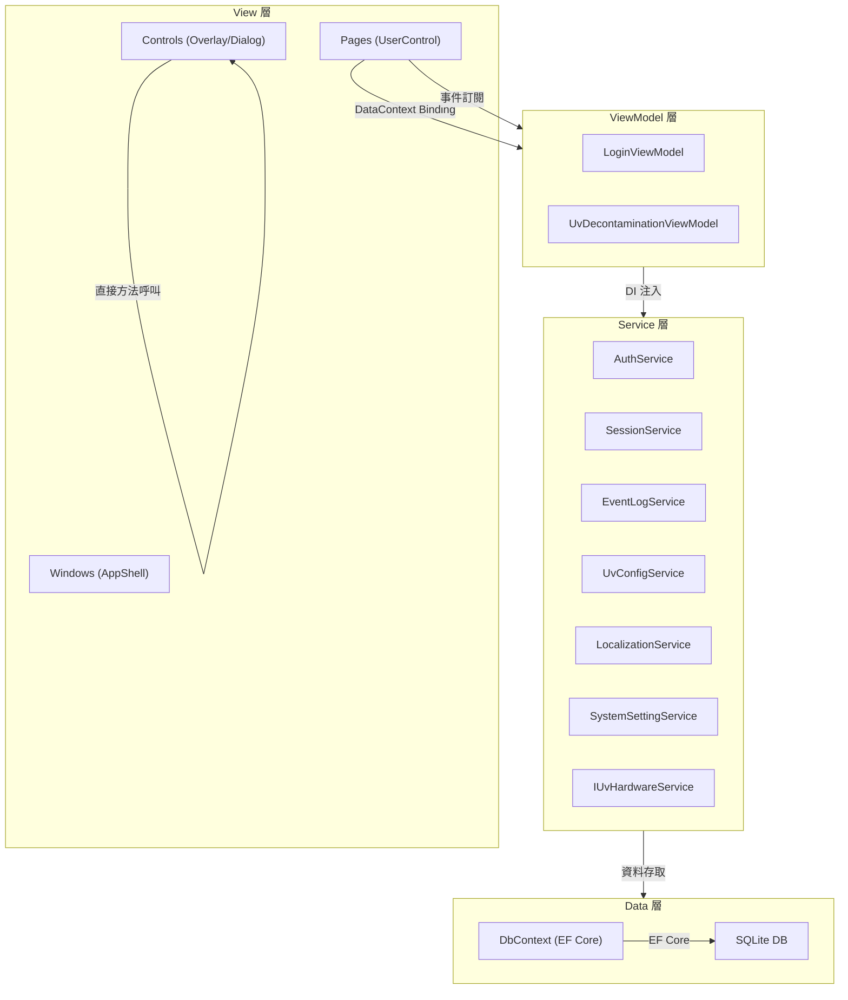

# TRIO2026 UI 架構設計文件 — MVVM 採用現況分析

> **文件版本**: v1.0  
> **分析日期**: 2026-05-18  
> **製作者**: Office of William  
> **適用範圍**: `TRIO2026.App` 專案（WPF .NET 8）

---

## 1. 摘要

TRIO2026 專案採用 **混合式 UI 架構**：功能較複雜的頁面（Login、UV Decontamination）遵循 MVVM 模式，其餘頁面（Menu、Init）及所有自訂控件（Overlay、Dialog）仍使用傳統 Code-Behind 模式。此設計為漸進式遷移的結果，並非全面 MVVM 重構。

---

## 2. 架構總覽

### 2.1 專案分層

```
TRIO2026.sln
├── TRIO2026.Core          ← 領域實體（Entity）、介面（Interface）、常數
├── TRIO2026.Data          ← DbContext、Migration、Seeding、Repository
└── TRIO2026.App           ← WPF UI 層（View + ViewModel + Services）
    ├── Helpers/           ← MVVM 基礎設施（ViewModelBase, RelayCommand）
    ├── ViewModels/        ← ViewModel 類別
    ├── Views/             ← Window 與 Page（View 層）
    │   └── Pages/         ← UserControl 頁面
    ├── Controls/          ← 自訂 UI 控件（Overlay、Dialog）
    └── Services/          ← 業務邏輯服務（Auth、EventLog、Session 等）
```

### 2.2 MVVM 基礎設施

| 檔案 | 路徑 | 說明 |
|------|------|------|
| `ViewModelBase.cs` | [ViewModelBase.cs](file:///d:/TRIO2026/src/TRIO2026.App/Helpers/ViewModelBase.cs) | 抽象基底類，實作 `INotifyPropertyChanged`，提供 `SetProperty<T>()` 與 `OnPropertyChanged()` |
| `RelayCommand.cs` | [RelayCommand.cs](file:///d:/TRIO2026/src/TRIO2026.App/Helpers/RelayCommand.cs) | 同步 `ICommand` 實作，支援 `CanExecute` 判斷 |
| `AsyncRelayCommand` | [RelayCommand.cs#L32](file:///d:/TRIO2026/src/TRIO2026.App/Helpers/RelayCommand.cs#L32) | 非同步 `ICommand` 實作，內建防重複執行（`_isExecuting` 旗標） |

> [!NOTE]
> 未使用第三方 MVVM 框架（如 CommunityToolkit.Mvvm、Prism、ReactiveUI）。所有 MVVM 基礎設施為手動實作。

---

## 3. 各元件 MVVM 採用現況

### 3.1 總覽對照表

| 元件 | 類型 | ViewModel | DataContext 綁定 | XAML Binding | 模式 | 備註 |
|------|------|-----------|-----------------|-------------|------|------|
| **LoginPage** | Page | ✅ `LoginViewModel` | ✅ | ✅ 7 處 | ✅ MVVM | 完整 MVVM |
| **UvDecontaminationPage** | Page | ✅ `UvDecontaminationViewModel` | ✅ | ✅ 16 處 | ✅ MVVM | 完整 MVVM |
| **MenuPage** | Page | ❌ 無 | ❌ | ❌ | ❌ Code-Behind | 按鈕事件全在 .xaml.cs |
| **InitPage** | Page | ❌ 無 | ❌ | ❌ | ❌ Code-Behind | 純倒數邏輯 |
| **AppShell** | Window | ❌ 無 | ❌ | ❌ | ❌ Code-Behind | 導航容器 |
| **LoginWindow** | Window | ✅ `LoginViewModel` | ✅ | ✅ | ✅ MVVM | 遺留 Window（Obsolete） |
| **InitWindow** | Window | ❌ 無 | ❌ | ❌ | ❌ Code-Behind | 遺留 Window（Obsolete） |
| **MainWindow** | Window | ❌ 無 | ❌ | ❌ | ❌ Code-Behind | 遺留 Window（Obsolete） |
| **OverlayDialog** | Control | ❌ 無 | ❌ | ❌ | ❌ Code-Behind | 通用對話框 |
| **LoginOverlay** | Control | ❌ 無 | ❌ | ❌ | ❌ Code-Behind | 登入覆蓋層 |
| **UserMenuControl** | Control | ❌ 無 | ❌ | ❌ | ❌ Code-Behind | 最厚重（12KB code-behind） |
| **UvDoorErrorOverlay** | Control | ❌ 無 | ❌ | ❌ | ❌ Code-Behind | 門板錯誤覆蓋層 |
| **UvStopConfirmOverlay** | Control | ❌ 無 | ❌ | ❌ | ❌ Code-Behind | UV 停止確認覆蓋層 |

### 3.2 統計

```
MVVM 頁面:     2 / 4  (50%)
Code-Behind:   2 / 4  (50%)
Controls:      0 / 5  (0%) — 全部 Code-Behind
遺留 Windows:  3 個（LoginWindow, InitWindow, MainWindow）— 已計劃移除
```

---

## 4. 詳細分析

### 4.1 ✅ MVVM 頁面

#### LoginPage + LoginViewModel

```
LoginPage.xaml ──Binding──> LoginViewModel : ViewModelBase
    ├── Username        (TwoWay Binding)
    ├── RememberMe      (TwoWay Binding)
    ├── HasError         (OneWay → Visibility)
    ├── ErrorMessage     (OneWay → TextBlock)
    ├── ScreenInfo       (OneWay → TextBlock)
    └── LoginCommand     (ICommand → Button)
```

- **DataContext 設定方式**: Constructor injection → `DataContext = _viewModel`
- **PasswordBox 特殊處理**: 因 WPF PasswordBox 不支援 Binding，在 code-behind 透過 `PasswordChanged` 事件同步到 ViewModel
- **View 事件**: `LoginSucceeded` 事件通知 Shell 進行頁面切換

#### UvDecontaminationPage + UvDecontaminationViewModel

```
UvDecontaminationPage.xaml ──Binding──> UvDecontaminationViewModel : ViewModelBase
    ├── IsRunning            (DataTrigger × 5)
    ├── ShowTimeSelector     (OneWay → Visibility)
    ├── ShowCountdown        (OneWay → Visibility)
    ├── SelectedDisplayLabel (OneWay → TextBlock)
    ├── RemainingDisplay     (OneWay → TextBlock)
    ├── StartStopCommand     (ICommand → Button)
    ├── PreviousCommand      (ICommand → Button)
    └── NextCommand          (ICommand → Button)
```

- **DataContext 設定方式**: Constructor injection → `DataContext = _viewModel`
- **ViewModel 事件（通知 View）**:
  - `CountdownCompleted` → View 顯示完成 OverlayDialog
  - `StopRequested` → View 顯示 UvStopConfirmOverlay
  - `DoorInterrupted` / `DoorResumed` → View 控制 UvDoorErrorOverlay
- **View → ViewModel 回調**: `ConfirmStopAsync()` 由 View 在確認後調用

### 4.2 ❌ Code-Behind 頁面

#### MenuPage

```
MenuPage.xaml.cs
    ├── OnIntelliPlexClick()   → 直接呼叫 OverlayDialog
    ├── OnCustomClick()        → 直接呼叫 OverlayDialog
    ├── OnDataClick()          → 直接呼叫 OverlayDialog
    ├── OnSettingClick()       → 直接呼叫 OverlayDialog
    └── OnUVClick()            → 直接呼叫 AppShell.NavigateTo("uv")
```

- **原因**: 目前僅有 5 個按鈕的簡單導航，無需獨立 ViewModel
- **潛在重構時機**: 當需要動態權限過濾（依 RoleLevel 顯示/隱藏按鈕）時

#### InitPage

```
InitPage.xaml.cs
    ├── _remainingSeconds      → 倒數秒數
    ├── _timer                 → DispatcherTimer
    └── CountdownCompleted     → 事件通知 Shell
```

- **原因**: 純倒數計時器，邏輯極簡（約 45 行），抽出 ViewModel 反而過度工程化
- **潛在重構時機**: 若需增加初始化進度條、狀態回報等功能

### 4.3 Controls（全部 Code-Behind）

| 控件 | Code-Behind 大小 | 說明 |
|------|-----------------|------|
| `UserMenuControl` | 12,702 bytes | 最複雜：使用者圖示、登入/登出、權限切換、帳號管理 |
| `OverlayDialog` | 5,573 bytes | 通用對話框：支援 1/2/3 按鈕模式 |
| `LoginOverlay` | 3,090 bytes | 權限提升用登入覆蓋層 |
| `UvStopConfirmOverlay` | 2,137 bytes | UV 停止確認覆蓋層 |
| `UvDoorErrorOverlay` | 1,044 bytes | 門板開啟錯誤提示 |

> [!TIP]
> Controls 不使用 MVVM 是業界常見做法。自訂控件作為「可重用 UI 元件」，其狀態管理通常透過 DependencyProperty 或直接方法呼叫，而非 ViewModel 綁定。

---

## 5. 資料流架構



### 5.1 ViewModel ↔ View 通訊模式

| 方向 | 機制 | 範例 |
|------|------|------|
| **ViewModel → View（狀態）** | `INotifyPropertyChanged` + XAML `{Binding}` | `IsRunning` → 按鈕樣式切換 |
| **ViewModel → View（操作）** | C# `event EventHandler` | `CountdownCompleted` → 顯示 OverlayDialog |
| **View → ViewModel（指令）** | `ICommand` + XAML `Command={Binding}` | `StartStopCommand` |
| **View → ViewModel（回調）** | 直接呼叫 public 方法 | `ConfirmStopAsync()` |

---

## 6. DI 注入模式

ViewModel 和 Service 透過 Constructor Injection 取得依賴：

```csharp
// ViewModel 注入 Service
public UvDecontaminationViewModel(
    UvConfigService configService,
    IUvHardwareService hardwareService) { ... }

// Page 注入 ViewModel + Services
public UvDecontaminationPage(
    UvDecontaminationViewModel viewModel,
    SessionService sessionService,
    ...) 
{
    DataContext = _viewModel;  // MVVM 綁定點
}
```

> [!IMPORTANT]
> DI 容器註冊在 `App.xaml.cs` 中完成，所有 Page、ViewModel、Service 均為 DI 管理。

---

## 7. 多語系整合

多語系字串不透過 ViewModel 轉發，而是 XAML 直接綁定 `LocalizationService` 靜態實例：

```xml
<!-- XAML 中直接綁定 LocalizationService -->
Text="{Binding [UV.Title], Source={x:Static svc:LocalizationService.Instance}}"
```

此設計的優缺點：

| 面向 | 說明 |
|------|------|
| ✅ 優點 | ViewModel 不需為每個字串建立屬性，減少樣板代碼 |
| ✅ 優點 | 語言切換時 `LocalizationService` 通知所有綁定自動更新 |
| ⚠️ 缺點 | View 直接依賴 Service（違反嚴格 MVVM 分層） |

---

## 8. 設計決策紀錄

### 8.1 為何不全面採用 MVVM？

1. **漸進式重構策略**: 從 Qt/C++ 遷移到 WPF，優先保證功能正確性，再逐步引入 MVVM
2. **簡單頁面不需過度工程化**: InitPage（45 行）和 MenuPage（73 行）邏輯極簡
3. **Controls 的性質**: 自訂控件通常透過 API（方法/屬性）與外部互動，不需要 ViewModel

### 8.2 為何不使用第三方 MVVM 框架？

1. **減少依賴**: 專案已依賴 EF Core、BCrypt 等，避免引入額外 NuGet
2. **基礎設施已足夠**: `ViewModelBase` + `RelayCommand` 已覆蓋當前需求
3. **團隊學習成本**: 自行實作的程式碼更容易理解與除錯

---

## 9. 未來重構建議

### 9.1 短期（可選）

| 項目 | 優先級 | 說明 |
|------|--------|------|
| MenuPage → MVVM | 🟡 中 | 當需要動態權限過濾時再重構 |
| UserMenuControl 瘦身 | 🟡 中 | 12KB code-behind 過於厚重，可考慮拆分邏輯到 Service |

### 9.2 長期（建議）

| 項目 | 優先級 | 說明 |
|------|--------|------|
| 引入 CommunityToolkit.Mvvm | 🟢 低 | 替代手寫 ViewModelBase，提供 `[ObservableProperty]` 等 Source Generator |
| Navigation Service | 🟢 低 | 將 `AppShell.NavigateTo("uv")` 抽象為 `INavigationService`，解耦 View 間導航 |
| 統一 ViewModel 事件 → Messenger | 🟢 低 | 用 Messenger/EventAggregator 替代直接 event 訂閱 |

---

## 10. 檔案索引

### ViewModels

| 檔案 | 路徑 | 大小 |
|------|------|------|
| LoginViewModel | [LoginViewModel.cs](file:///d:/TRIO2026/src/TRIO2026.App/ViewModels/LoginViewModel.cs) | 6,103 bytes |
| UvDecontaminationViewModel | [UvDecontaminationViewModel.cs](file:///d:/TRIO2026/src/TRIO2026.App/ViewModels/UvDecontaminationViewModel.cs) | 12,579 bytes |

### Views / Pages

| 檔案 | 路徑 | 模式 |
|------|------|------|
| LoginPage | [LoginPage.xaml](file:///d:/TRIO2026/src/TRIO2026.App/Views/Pages/LoginPage.xaml) / [.cs](file:///d:/TRIO2026/src/TRIO2026.App/Views/Pages/LoginPage.xaml.cs) | MVVM |
| UvDecontaminationPage | [UvDecontaminationPage.xaml](file:///d:/TRIO2026/src/TRIO2026.App/Views/Pages/UvDecontaminationPage.xaml) / [.cs](file:///d:/TRIO2026/src/TRIO2026.App/Views/Pages/UvDecontaminationPage.xaml.cs) | MVVM |
| MenuPage | [MenuPage.xaml](file:///d:/TRIO2026/src/TRIO2026.App/Views/Pages/MenuPage.xaml) / [.cs](file:///d:/TRIO2026/src/TRIO2026.App/Views/Pages/MenuPage.xaml.cs) | Code-Behind |
| InitPage | [InitPage.xaml](file:///d:/TRIO2026/src/TRIO2026.App/Views/Pages/InitPage.xaml) / [.cs](file:///d:/TRIO2026/src/TRIO2026.App/Views/Pages/InitPage.xaml.cs) | Code-Behind |

### Controls

| 檔案 | 路徑 | 大小 |
|------|------|------|
| UserMenuControl | [UserMenuControl.xaml.cs](file:///d:/TRIO2026/src/TRIO2026.App/Controls/UserMenuControl.xaml.cs) | 12,702 bytes |
| OverlayDialog | [OverlayDialog.xaml.cs](file:///d:/TRIO2026/src/TRIO2026.App/Controls/OverlayDialog.xaml.cs) | 5,573 bytes |
| LoginOverlay | [LoginOverlay.xaml.cs](file:///d:/TRIO2026/src/TRIO2026.App/Controls/LoginOverlay.xaml.cs) | 3,090 bytes |
| UvStopConfirmOverlay | [UvStopConfirmOverlay.xaml.cs](file:///d:/TRIO2026/src/TRIO2026.App/Controls/UvStopConfirmOverlay.xaml.cs) | 2,137 bytes |
| UvDoorErrorOverlay | [UvDoorErrorOverlay.xaml.cs](file:///d:/TRIO2026/src/TRIO2026.App/Controls/UvDoorErrorOverlay.xaml.cs) | 1,044 bytes |

### Helpers (MVVM Infrastructure)

| 檔案 | 路徑 | 說明 |
|------|------|------|
| ViewModelBase | [ViewModelBase.cs](file:///d:/TRIO2026/src/TRIO2026.App/Helpers/ViewModelBase.cs) | INotifyPropertyChanged 基底類 |
| RelayCommand | [RelayCommand.cs](file:///d:/TRIO2026/src/TRIO2026.App/Helpers/RelayCommand.cs) | 同步 + 非同步 ICommand 實作 |

### Services

| 檔案 | 路徑 | 大小 | 說明 |
|------|------|------|------|
| AuthService | [AuthService.cs](file:///d:/TRIO2026/src/TRIO2026.App/Services/AuthService.cs) | 3,093 bytes | 帳號密碼驗證、BCrypt、鎖定機制 |
| SessionService | [SessionService.cs](file:///d:/TRIO2026/src/TRIO2026.App/Services/SessionService.cs) | 1,897 bytes | 當前使用者 Session 管理 |
| EventLogService | [EventLogService.cs](file:///d:/TRIO2026/src/TRIO2026.App/Services/EventLogService.cs) | 13,676 bytes | 非同步佇列式事件日誌 |
| LocalizationService | [LocalizationService.cs](file:///d:/TRIO2026/src/TRIO2026.App/Services/LocalizationService.cs) | 3,759 bytes | 多語系字串管理 |
| SystemSettingService | [SystemSettingService.cs](file:///d:/TRIO2026/src/TRIO2026.App/Services/SystemSettingService.cs) | 8,449 bytes | 系統設定讀寫（system_config.db） |
| UvConfigService | [UvConfigService.cs](file:///d:/TRIO2026/src/TRIO2026.App/Services/UvConfigService.cs) | 2,509 bytes | UV 時間選項管理 |
| TokenService | [TokenService.cs](file:///d:/TRIO2026/src/TRIO2026.App/Services/TokenService.cs) | 2,512 bytes | 登入 Token 管理 |
| MockUvHardwareService | [MockUvHardwareService.cs](file:///d:/TRIO2026/src/TRIO2026.App/Services/MockUvHardwareService.cs) | 1,368 bytes | UV 硬體模擬（開發用） |
| AppConfigService | [AppConfigService.cs](file:///d:/TRIO2026/src/TRIO2026.App/Services/AppConfigService.cs) | 2,886 bytes | 應用程式組態（遺留，待整合） |
| EventLogArchiveService | [EventLogArchiveService.cs](file:///d:/TRIO2026/src/TRIO2026.App/Services/EventLogArchiveService.cs) | 12,020 bytes | 事件日誌歸檔與備份 |
| ScreenDetector | [ScreenDetector.cs](file:///d:/TRIO2026/src/TRIO2026.App/Services/ScreenDetector.cs) | 1,332 bytes | 螢幕解析度偵測 |
